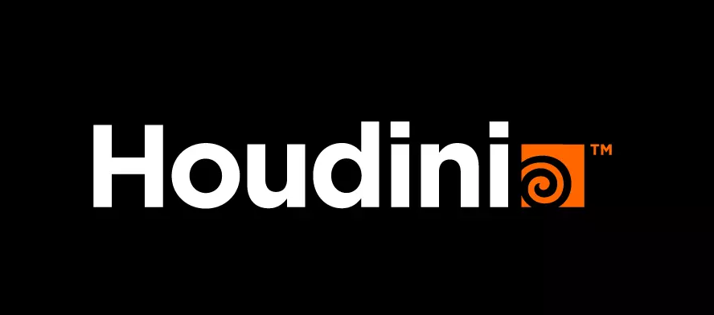

<h1>Kwesikwaa Hayford</h1>
<h3>Software Engineer, Unity+Unreal Engines, SideFx Houdini</h3>

<!-- 

  
<h3>Connect with me:</h3>

 -->

<h3>Frontend</h3>

<h3 >Backend</h3>

 

<h3 >Embedded/IoT</h3>

   

<h3 >DevOps</h3>

                

<h3 >Security</h3>

       

<h3>3D & Games</h3>

   

